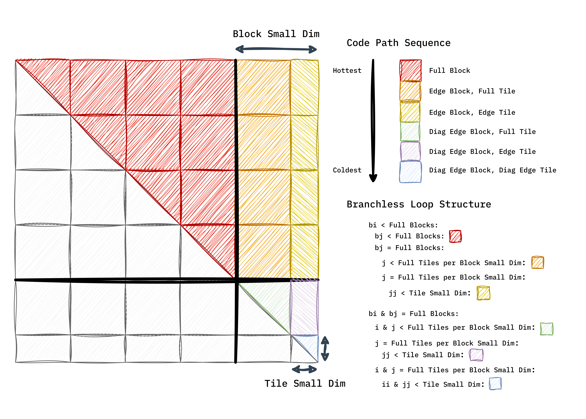

# About
A square inplace transpose kernel that outperforms Intel MKL's `mkl_simatcopy`.

Achieving up to 1.45× speedup, maintaing microarchitectural behavior while improving throughput.

> Benchmarked on Intel i7 14700K @ 5.5 GHz

# Methodology
- Manual double cache blocking.  
- Loop structured specialization.  
- Vectorized 8x8 transpose subroutine.

## Double Cache Blocking
Matrix is partitioned into Blocks.  
Blocks are paritioned into Tiles.

BlockDim (BD) is manually tuned at 32 utilizing `perf`.  
TileDim (TD) is intentionally fixed at 8 for full `AVX2` vectorization.

## Loop Structured Specialization
To eliminate all runtime branching, the algorithm is restructured so that each data region flows into its dedicated loop.

Instead of using conditionals, the iteration space is partitioned so each loop only operates on the cases it is designed for. Converting conditional into structural logic, improving branch predictability.

## Vectorized 8x8 Transpose

This subroutine contributed significantly to the speedup. 

