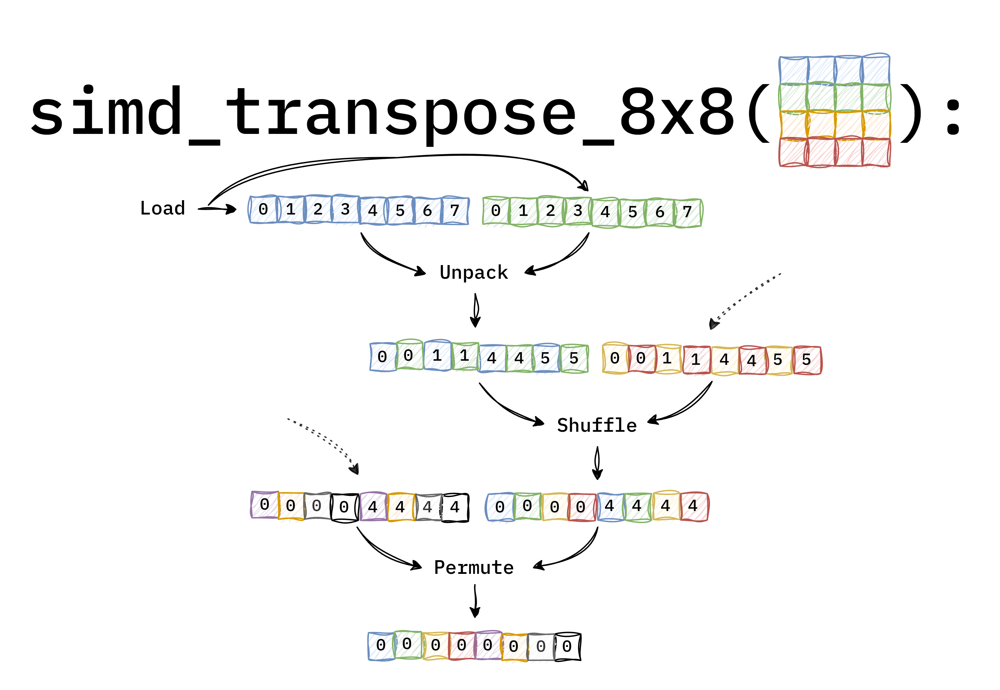

# Overview

* [About](#about)
* [Methodology](#methodology)

  * [Double Cache Blocking](#double-cache-blocking)
  * [Loop-Structured Progressive Specialization](#loop-structured-progressive-specialization)
  * [Vectorized Tile Transpose](#vectorized-tile-transpose)
* [Validation](#validation)

# About
A high-performance, cross platform, **fused inplace transpose-scale kernel** for square matrices, that reliably outperforms Intel MKL's `mkl_simatcopy` and OpenBLAS's `cblas_simatcopy` achieving up to a **5.8× speedup** for common matrix sizes.

$$
\mathbf{A} := \alpha \mathbf{A}^\top
$$

> Implemented in both **SSE/AVX2 (x86)** and **NEON (ARM64)** with static dispatch.
```cpp
void transpose_inplace_tiled_simd(float* A, const uint32_t m, const float alpha, const uint32_t stride)
```


The design maintains healthy microarchitectural behavior while improving throughput (*Elements per Cycle*).


> Benchmarked  with `alpha = 2.0` on Intel i7 14700K @ 5.5 GHz   
> Against Intel MKL `mkl_simatcopy` 2025.1.0 Release  

# Methodology
- Manual double cache blocking.  
- Loop structured progressive specialization.  
- Vectorized tile transpose.

## Double Cache Blocking
Matrix is partitioned into **Blocks**, and each **Block** is partitioned into **Tiles**.

- **BlockDim (BD)**: manually tuned to 32 utilizing `perf`.  
- **TileDim (TD)**: fixed at 8 or 4 to enable vectorized tile transpose.


## Loop-Structured Progressive Specialization
To eliminate all runtime branching, the algorithm is **progressively specialized**: 

### Specialization
Each data region flows into its own *__dedicated loop__*, progressing from hotter to colder paths by partitioning the iteration space so each loop only operates on the cases it's explicitly designed for, avoiding conditionals and improving branch predictability.

### Progressive
Colder paths reuse precomputed values and base addresses established by earlier, hotter loops. This not only reduces redundant computation but also enables *__loop removal__* via hardcoded base indexing. Thus, flattening higher level control flow into dedicated structures and eliminating the need for additional loop induction variables, resulting in cleaner logic and improved branch predictability.


## Vectorized Tile Transpose
A subroutine that performs an in-register transpose of a tile on all code paths with the `Full Block` and/or `Full Tile` properties. Contributing significantly to the observed performance improvement.

```cpp
inline void simd_transpose_tile(const float* src, const uint32_t src_stride, float* dst, const uint32_t dst_stride, const float alpha)
```

1) Loads 8 rows from the source pointer `src`
2) Rearrange rows into columns using a sequence of SIMD intrinsics. 
3) Stores columns contiguously at the destination pointer `dst`.

The following image is an example of `simd_transpose_tile` implemented in AVX2:



- **AVX2 (x86)**: Transposes 8×8 tiles using 256-bit `__m256` vectors, and `unpack`, `shuffle`, `permute` intrinsics.
- **SSE (x86)**: Transposes 4×4 tiles using 128-bit `__m128` vectors, and `unpack`, `shuffle` intrinsics.
- **NEON (ARM64)**: Transposes 4×4 tile using 128-bit `float32x4_t` vectors, and `vtrn`, `vcombine` intrinsics.

# Validation
The kernels were benchmarked reliably with:

- Stable Clock Frequency
- Core Pinning
- Aligned Memory
- Cache Padding 

Ensuring the reported performance improvements are meaningful and reproducible.

## Stable Clock Frequency
All benchmarks are run with the CPU frequency governor, pinning all cores to their maximum frequency throughout the run. Ensuring consistent cycle counts and throughput measurements.

```bash
sudo cpupower frequency-set -g performance
```

## Core Pinning
To minimize OS core migration and schedueling jitter, both kernels were pinned to a single physical core.

```cpp
cpu_set_t cpu_set;
CPU_ZERO(&cpu_set);
CPU_SET(cpu_id, &cpu_set);
sched_setaffinity(0, sizeof(cpu_set_t), &cpu_set);
```

##  Memory Alignment
All memory allocations are 64-byte aligned. Avoids penalties from misaligned loads/stores, while matching the CPU cache line size.

```cpp
inline size_t get_alloc_size(uint32_t n_floats){
    uint32_t allocated_cache_lines= (n_floats + floats_per_cacheline - 1)/floats_per_cacheline;
    return static_cast<size_t>(allocated_cache_lines* CACHE_LINE_SIZE);
}

float* A= static_cast<float*>(aligned_alloc(CACHE_LINE_SIZE, get_alloc_size(m*stride)));
```

## Cache Padding

To avoid cache trashing, row strides are padded with `floats_per_cacheline` to ensure consecutive rows occupy separate cache lines.

```cpp
constexpr size_t CACHE_LINE_SIZE= 64;
constexpr size_t floats_per_cacheline= CACHE_LINE_SIZE / sizeof(float);
const uint32_t stride= m + floats_per_cacheline;
```