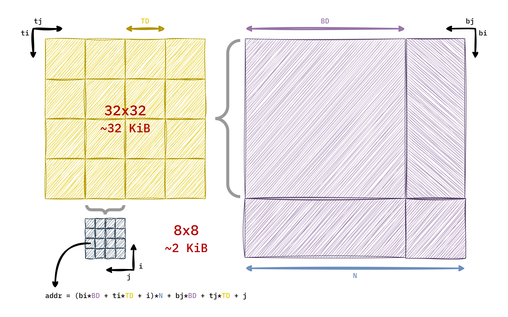

# About
A square inplace transpose kernel that outperforms Intel MKL's `mkl_simatcopy`.

Achieving up to 1.45× speedup, maintaing microarchitectural behavior while improving throughput.

> Benchmarked on Intel i7 14700K @ 5.5 GHz

# Methodology
- Manual double cache blocking.  
- Loop structured specialization.  
- Vectorized 8x8 transpose subroutine.

## Double Cache Blocking
Matrix is partitioned into Blocks.  
Blocks are paritioned into Tiles.

BlockDim (BD) is manually tuned at 32 utilizing `perf`.  
TileDim (TD) is intentionally fixed at 8 for full `AVX2` vectorization.

## Loop Structured Specialization
To eliminate all runtime branching, the algorithm is restructured so that each data region flows into its dedicated loop.

Instead of using conditionals, the iteration space is partitioned so each loop only operates on the cases it is designed for. Converting conditional into structural logic, improving branch predictability.

## Vectorized 8x8 Transpose

A subroutine that performs an in-register transpose of an 8×8 float tile. It loads 8 rows into ymmX registers from the source pointer, then reorganizes them into columns using a sequence of unpack, shuffle, and permute AVX2 intrinsics. The transposed data is then stored contiguously to the destination pointer.

