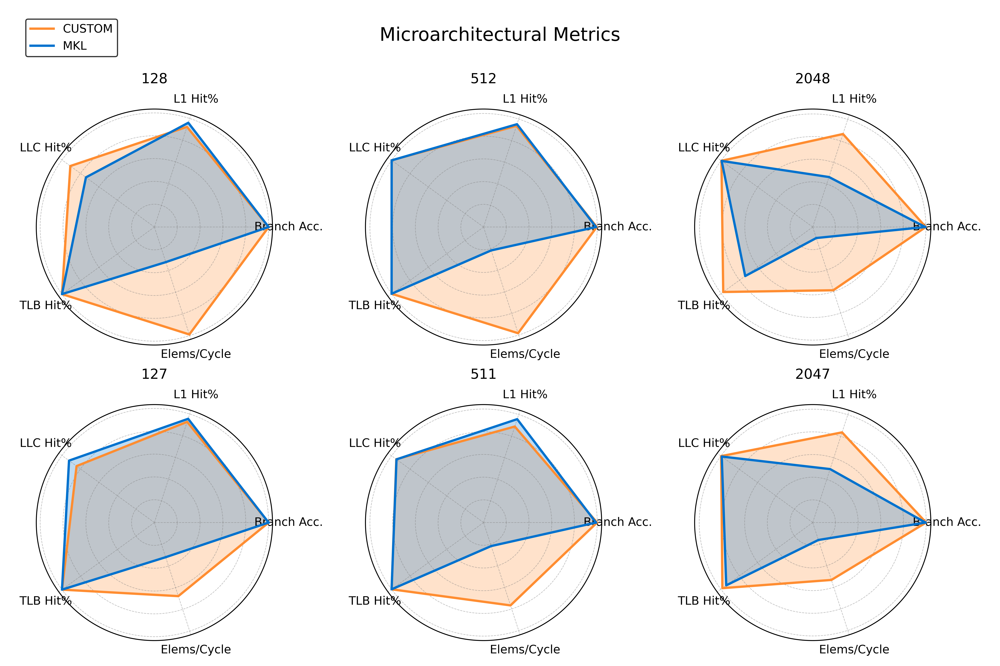

# About
An inplace square transpose kernel that reliably **outperforms Intel MKL**'s `mkl_simatcopy` achieving up to a **1.49× speedup**.

```cpp
 void transpose_inplace_tiled_simd(float* A, const uint32_t m, const uint32_t stride)
```


The design maintains healthy microarchitectural behavior while improving throughput (*Elements per Cycle*).


> Benchmarked on Intel i7 14700K @ 5.5 GHz  
> Against Intel MKL 2025.1.0 Release  

# Methodology
- Manual double cache blocking.  
- Loop structured specialization.  
- Vectorized 8x8 AVX2 transpose subroutine.

## Double Cache Blocking
Matrix is partitioned into **Blocks**, and each **Block** is paritioned into **Tiles**.

- **BlockDim (BD)**: manually tuned to 32 utilizing `perf`.  
- **TileDim (TD)**: fixed at 8 to enable vectorized 8x8 transpose.


## Loop-Structured Progressive Specialization
To eliminate all runtime branching, the algorithm is **progressively specialized**: 

### Specialization
Each data region flows into its own dedicated *__loop__*, progressing from hotter to colder paths by partitioning the iteration space so each loop only operates on the cases it's explicitly designed for, avoiding conditionals and improving branch predictability.

### Progressive
Colder paths reuse precomputed values and base addresses established by earlier, hotter loops, reducing redundant computation while maintaining branch free control flow.


## Vectorized 8x8 Transpose

A subroutine that performs an in-register transpose of an 8×8 tile on all code paths with the `Full Block` and/or `Full Tile` properties. Contributing significantly to the observed performance improvement over `mkl_simatcopy`.

```cpp
 void simd_transpose_8x8(const float* src, const uint32_t src_stride, float* dst, const uint32_t dst_stride)
```

1) Loads 8 rows into `ymmX` registers from the source pointer `src`
2) Rearrange rows into columns using a sequence of `unpack`, `shuffle`, and `permute` AVX2 intrinsics. 
3) Stores columns contiguously at the destination pointer `dst`.

> TileDim is fixed at 8 to align perfectly with AVX2 register width.


